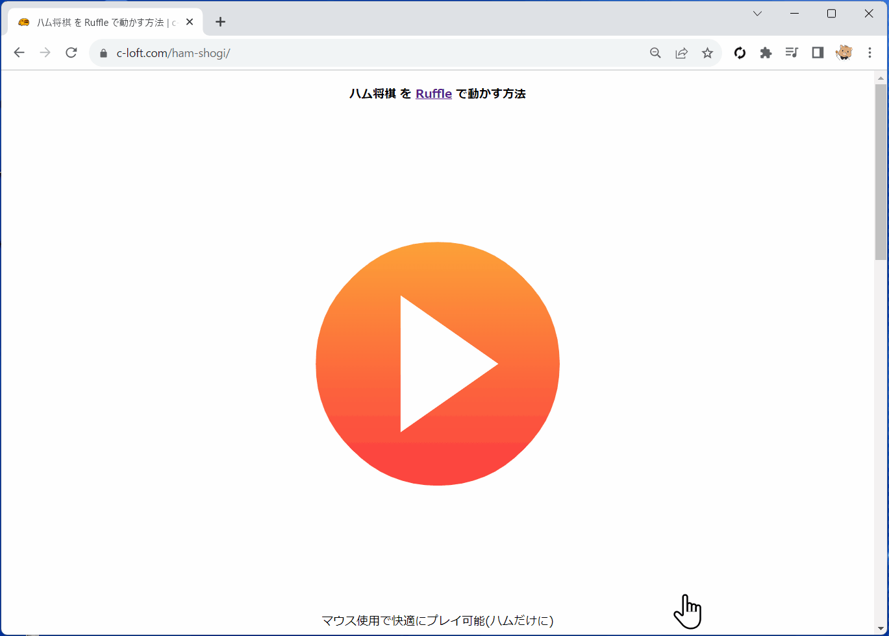

# Ham Shogi Ruffle

The legendary Shogi game "Ham Shogi" run by the Flash Player emulator "Ruffle".

## Demo

[ハム将棋 非公式 Ruffle 動作手順デモ](https://c-loft.com/ham-shogi/)

## Japanese language support

Using [midorism64/ruffle](https://github.com/midorism64/ruffle) instead of [ruffle-rs/ruffle](https://github.com/ruffle-rs/ruffle).

## Disclaimer

I am not liable for any trouble, loss, or damage arising from any acts performed as a result of decisions made based on the information contained on this repository or demo.
